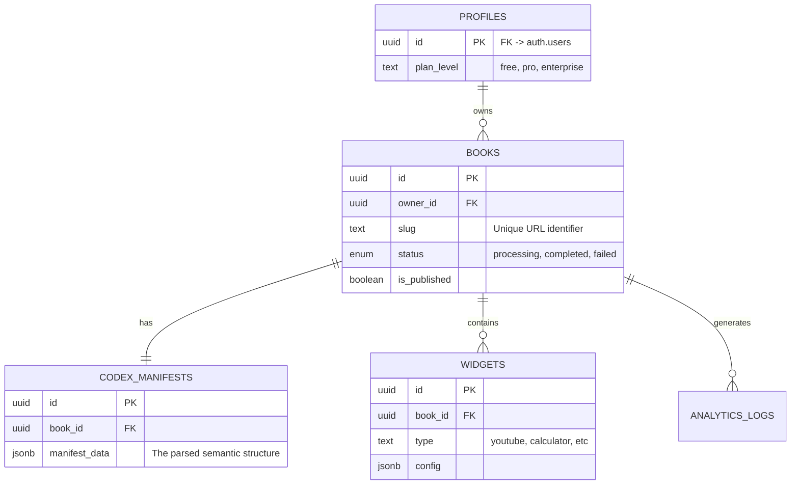

# Project Codex Database Schema (MVP)

## Overview
This document details the PostgreSQL schema implemented for the Project Codex MVP. The database is hosted on Supabase and is designed to support the "PDF-to-Web-App" conversion workflow, managing user profiles, book projects, semantic JSON manifests, and interactive widgets.

## Entity-Relationship Diagram

## Custom Types

### `status_enum`
Tracks the state of the asynchronous conversion job.
- **Values:**
  - `'processing'`: The PDF is currently being parsed.
  - `'completed'`: Parsing succeeded, and the book is ready for editing.
  - `'failed'`: An error occurred during processing.

---

## Tables

### 1. `profiles`
Extends the default Supabase `auth.users` table to store application-specific user data.
- **Primary Key:** `id` (References `auth.users.id`)
- **Key Columns:**
  - `plan_level`: Determines feature access (default: `'free'`).
  - `organization_name`: For B2B/Enterprise contexts.
- **Security:** RLS enabled. Users can only modify their own profile.

### 2. `books`
The central entity representing a digital asset (converted eBook).
- **Primary Key:** `id` (UUID)
- **Foreign Key:** `owner_id` (References `profiles.id`)
- **Key Columns:**
  - `slug`: Unique, URL-friendly identifier for public access.
  - `title`: The internal/display title of the book.
  - `description`: Technical or internal summary of the content.
  - `author`: The content's author (extracted from PDF).
  - `seo_title`: Crawler-optimized title (defaults to `title`).
  - `seo_description`: Crawler-optimized description (defaults to `description`).
  - `seo_tags`: Array of keywords for meta tags.
  - `original_pdf_url`: Storage path to the source file.
  - `status`: Current processing state (`status_enum`).
  - `is_published`: Controls public visibility.
- **Indexes:** `owner_id`, `slug`, `status`, `author`.

### 3. `codex_manifests`
Stores the "Single Source of Truth" for the book's content—a JSON structure generated by the Python Semantic Parser.
- **Primary Key:** `id` (UUID)
- **Foreign Key:** `book_id` (References `books.id`, Unique Constraint ensures 1:1 relationship)
- **Key Columns:**
  - `manifest_data`: The raw JSONB data used by the Renderer.
- **Indexes:** 
  - **GIN Index**: `jsonb_path_ops` on `manifest_data` for optimized block-level existence and path lookups (Fastest for `@>` operator).
  - `manifest_data->'meta'->>'title'` (Functional Index).
  - `manifest_data->'meta'->>'author'` (Functional Index).

### 4. `widgets`
A registry of interactive components added to specific blocks within a book.
- **Primary Key:** `id` (UUID)
- **Foreign Key:** `book_id` (References `books.id`)
- **Key Columns:**
  - `block_id`: The ID of the text/layout block where the widget is anchored.
  - `type`: The widget identifier (e.g., `youtube_embed`).
  - `config`: JSONB configuration (e.g., video URL, calculator parameters).

### 5. `analytics_logs`
A lightweight logging table for tracking viewer engagement events.
- **Primary Key:** `id` (BigInt Identity)
- **Foreign Key:** `book_id` (References `books.id`)
- **Key Columns:**
  - `event_type`: e.g., 'view', 'pwa_install'.
  - `geo_country`: derived from request headers.

---

## Storage Schema

The system uses Supabase Storage for file management.

### 1. `raw_pdfs` (Private)
Stores the original PDF files uploaded by authors.
- **Privacy:** Private (No public URL access).
- **Security:**
  - **Write/Read:** Authenticated users only.
  - **Constraint:** Files must be stored in a root folder matching the User ID (`{uid}/{filename}`).

### 2. `book_assets` (Public)
Stores optimized assets (images, fonts) extracted or generated for the web view.
- **Privacy:** Public (Files accessible via public URL).
- **Security:**
  - **Write:** Authenticated users (Owners) only.
  - **Constraint:** Files must be stored in a root folder matching the User ID (`{uid}/{filename}`).
  - **Read:** Public access allowed for serving content.

---

## Security (Row Level Security)

RLS is enabled on **all** tables to ensure strict data isolation.

| Table | Policy Name | Permission | Condition |
| :--- | :--- | :--- | :--- |
| **profiles** | Users manage own | ALL | `auth.uid() = id` |
| **books** | Users manage own | ALL | `auth.uid() = owner_id` |
| **books** | Public view published | SELECT | `is_published = TRUE` |
| **manifests** | Users manage own | ALL | Parent Book belongs to User |
| **manifests** | Public view published | SELECT | Parent Book is published |
| **widgets** | Users manage own | ALL | Parent Book belongs to User |
| **widgets** | Public view published | SELECT | Parent Book is published |
| **analytics_logs** | Default Deny | ALL | No access (Admin/System only) |

---

## Automation & Triggers

### `handle_updated_at`
A PL/pgSQL function that automatically updates the `updated_at` column to `NOW()`.

**Applied Triggers:**
- `set_profiles_updated_at`: Before UPDATE on `profiles`.
- `set_books_updated_at`: Before UPDATE on `books`.

### `sync_books_to_manifest`
A "Hybrid-Sync" trigger that automatically pushes changes from the `books` table into the corresponding `codex_manifests` JSON.
- **Logic:** Updates `manifest_data->'meta'` with current `title`, `description`, and `author`.
- **SEO Logic:** Uses `COALESCE` to default `seo.title` to `title` and `seo.description` to `description` unless explicitly overridden.
- **Triggered By:** UPDATE on `title`, `description`, `author`, `seo_title`, `seo_description`, or `seo_tags`.
